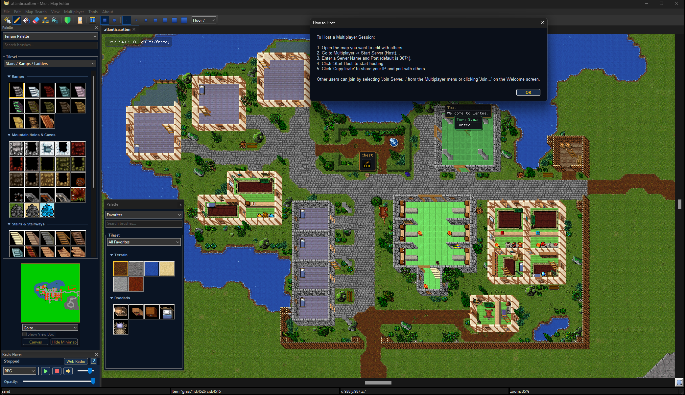

# Mio's Map Editor (MME) – Release History & Changelog

---

## 🚀 Release v1.9.0 (Latest Working Version)

### 🌟 Major Highlights & New Features in v1.9.0
* **Integrated Interactive Map Playtester (`File -> Test` / `F6`):**
  * Instant, in-process playtest window with shared OpenGL sprite renderer and zero overhead.
  * Real-time controllable character (WASD / Arrows), directional sprites, health/mana HUD.
  * Interactive map traversal: Stairs, ramps, and pit/hole floor drops.
  * Real-time Right-Click ladder and rope spot climbing.
  * Universal door interaction and light/torch toggling.
  * Integrated dedicated Weather simulation control toolbar (*Off, Clouds, Rain, Snow, Desert Heat, Fog*).

  

* **Super-Smooth HD Asset Upscaling (Anti-Aliased & De-Krisselled):**
  * Completely refined xBRZ & Super-xBR shader pipeline eliminating high-frequency dithering and grain artifacts.
  * Crystal-clear, smooth vector-like curves on all sprites, items, outfits, and terrain.
* **Realistic Raycasted Light Wall Collision & Directional Torches:**
  * High-resolution sub-tile supercover raycasting preventing light penetration through opaque walls.
  * Directional wall torch projection: Wall-mounted lights now illuminate only into the room and never leak backward into adjoining bedrooms.
* **Fully Synchronized Animated Grounds & Shore/Lava Border Cascades:**
  * Animated lava (`598..601`) and water ground sequences (`4608..4625`) with continuous real-time looping.
  * Breaking coastal wave borders and lava border sequences seamlessly rendered and updated in the VBO batch.
* **Smart Zoom Performance Throttling (60+ FPS Always):**
  * Automatic idle & animation pausing when zooming out from 50% down to 1% (`zoom >= 1.95f`), saving 100% of idle redraw cycles for maximum speed on large maps.

---

## 🚀 Release v1.8.8
* **Universal Light & Fire Object Toggle ("Use"):** Dynamic detection and pairing for all street lamps (1479 $\leftrightarrow$ 1480), campfires (1421..1428), coal basins, braziers, candelabras, torches, and lanterns.
* **Per-User Remote Favorites (Case-Insensitive):** Remote multiplayer favorites are automatically saved and loaded per nickname (e.g. `Bob`, `bob`, `BoB`) in local `.cfg` files on connect.
* **Streamlined Settings (Preferences):** Removed redundant multiplayer tab, added discrete 1-10 level steps for Global Light Intensity (default Level 7 / 70%), adjusted UI Scaling maximum to Level 10 (170%), and integrated `"Default"` reset buttons on every tab.
* **Procedural Generator Revert on Cancel:** Clicking `"Close"` / `"Cancel"` or closing the generator dialog immediately undoes and wipes generated map structures.
* **Monster & NPC Editor UX Polish:** Updated button label to `"Add to Creature Palette"` and simplified context menus to `"Select.."`.

#### 📜 RealOTS / Nostalrius Support (`File -> Import/Export -> .sec`)
* **Full 32x32 Sector Engine (`iomap_sec.h` & `iomap_sec.cpp`):** Native loader and saver for legacy `.sec` sector files (`<XXX><YYY><ZZ>.sec`), allowing direct mapping, loading, and saving of original CipSoft / RealOTS / Nostalrius maps across all Z-levels (0-15).
* **`objects.srv` Item Definition Parser:** Parses flags (`Bank`, `Clip`, `Chest`, `Cumulative`, `Take`, `Unpass`), attributes, weights, and server-to-client item mappings directly from server data files.
* **`monster.db` Spawn Integration:** Reads and writes legacy monster spawns (coordinates, count, respawn time, spawn radius) seamlessly when loading or saving sector maps.

#### 🔄 Server-ID $\leftrightarrow$ Client-ID & Format Converter Suite (`Tools -> RealOTS / CipSoft Converter`)
* **Bidirectional Map Conversion:** 1-Click conversion between OpenTibia `.otbm` maps and CipSoft `.sec` sector folders with automatic `monster.db` spawn generation.
* **Interactive Live ID Translator:** Triple-synchronized ID converter (CipSoft Server ID $\leftrightarrow$ Client DAT/Sprite ID $\leftrightarrow$ OpenTibia OTB ID) with live attribute & flag inspection.
* **Spawn Database Converter:** Converts `monster.db` to `spawns.xml` and vice versa.

#### 🛠️ Item & Assets Editor Suite (`Tools -> Item & Assets Editor...`)
* **In-Editor OTB & Item Inspector:** Live search across all Tibia items in memory with live rendering of item sprites inside a double-gold corporate card. Inspect and edit properties (Stackable, Unpassable, Blocks Missiles, Moveable, Rotatable, Hangable, Emits Light, Container capacity) with 1-click XML node export.
* **Arch-Mina Assets-Editor Integration:** Full integration for Arch-Mina's open-source C# (.NET 6) Assets Editor for Tibia 10.98–13+ (`.dat`, `.spr`, `.otb`, sprite sheet manager). 1-Click launcher directly from the editor tools menu.

#### 👹 Native In-Editor Monster Creator & Editor (`Tools -> Monster Editor...`)
* **All-in-One Monster Designer:** Design custom monsters with health, exp, speed, corpses, race, and combat parameters.
* **Visual Outfit Designer (TLG Engine):** Full LookType selector with 30 presets, LookTypeEx, Addons, Mounts, and interactive 132-color Tibia palette preview.
* **Attacks, Spells & Defenses:** Add custom melee, distance, and spell attacks with min/max damage, intervals, chances, and elemental resistance tables (-100% to 100%).
* **Item Loot Table Grid:** Add loot drops with item selection, max count, and percentage drop rates.
* **Instant Palette Registration:** "Register & Add to Creature Palette" immediately adds the new monster into the editor brush list so it can be painted onto maps instantly without restarting!

#### 🏰 Procedural World, Dungeon & Cave Generator Suite (`Tools -> Generators & Analysis -> Procedural Map Generator`)
* **Native 2-Pass Autobordering Engine:** Uses RME's native `BatchAction` and `WallBrush::doWalls` / `GroundBrush::doBorders` engine. All corners (diagonal, orthogonal, T-junctions, and end caps) and ground transitions generate seamlessly as if hand-drawn by a mapper.
* **Solid Structural Generation:** Generates clean, fully enclosed room perimeters with walkable interior floors and corridors that punch clean doorway openings without clutter.
* **Multi-Theme Presets:** 1-Click presets for *Ancient Catacombs*, *Lava / Inferno Vault*, *Ice / Glacier Cavern*, *Desert Tomb*, and *Subterranean Sewers*.
* **Multi-Floor & Cave Modes:** Multi-floor vertical generation and cellular automata organic cave generation with natural wall borders.
* **Interactive Live 2D Mini-Map Preview:** Live preview canvas displaying real-time map generation before committing to the canvas.
* **1-Click Retry Workflow:** The generation button dynamically switches to **"Retry"** to undo the previous attempt and roll a new layout with the same settings.
* **Strict Non-Destructive Protection:** Protects player-built houses, creatures, spawns, and containers from being overwritten.

#### 🔄 GitHub Releases 1-Click Update System (`About -> Check for Updates`)
* **Automated Update Detection:** Directly queries `https://api.github.com/repos/Mioshiru/MME/releases/latest` to compare versions.
* **In-App Download & Progress Tracking:** Downloads release archives directly inside the editor with a live progress dialog.
* **One-Click Auto-Restart:** Extracts and updates editor binaries automatically with zero manual file replacement required.

#### 📦 Locker & Depot Town Auto-Assignment
* **Distance-Based Town Resolution:** Placing a Locker/Depot automatically calculates 3D distance to the closest temple on the active map and assigns the town ID (e.g. *Lantea*).
* **Properties Dialog Integration:** Opening properties on a depot with town ID 0 automatically pre-selects the nearest town in the dropdown.

#### 🎯 Groundbrush Selection & Palette Navigation
* **Instant Palette Focus:** Using "Select Groundbrush" (or RAW/Wall/Doodad brush) via right-click on any map tile immediately navigates to, scrolls, and highlights the tile in the palette.
* **Robust Unselected Tile Lookups:** Right-clicking tiles without making a prior selection now reliably resolves the clicked map tile.

#### 🎡 Radial Tool Wheel Cleanup (`Shift + Q`)
* **Synchronized 8-Tool Wheel:** Streamlined the radial menu to 8 core tools (*Selection, Pencil, Bucket, Zones, Doors, Windows, Eraser, Prefab Creator*) with 1:1 slice-to-action alignment.

#### 🚫 "No Hotkeys" Mode & Rotate Item Menu Actions
* **Prominent Menubar Placement:** "No Hotkeys Mode" is accessible directly under **`Edit`** (and `Tools -> Map Tools`) with a live checkmark indicator.
* **Dedicated "Rotate Item (Z)" Action:** Added under **`Edit -> Rotate Item (Z)`** for effortless ramp, stair, table, and item rotation.

#### 📻 Built-In Fantasy Web Radio Player (`Tools -> Radio`)
* **24/7 Game Music Streams:** Built-in streaming audio player with full Rainwave (*ALL, Game, Chiptune, OC ReMix, Covers, Chill*) and RPGamers Radio (*RPG*) live streams.

#### 🌐 Live Multiplayer Collaborative Mapping Engine
* **Real-Time Live-Ping & Latency HUD:** High-resolution bidirectional RTT measurement using `std::chrono::steady_clock`. Displays accurate millisecond latency and packet loss in real time across the internet for both Host and connected Clients.
* **Guaranteed Multiplayer Autobordering:** Autoborder is automatically enforced for all connected clients during multiplayer sessions (`IsLive()`), eliminating desync or missing border transitions regardless of local client config.
* **Clean Network Teardown & Exit:** Background Asio worker loops are managed with lifetime work guards (`make_work_guard`), guaranteeing clean, instant disconnects without editor freezes.
* **High-Speed Initial Map Synchronization:** Integrated the RPG Loading Bar during map downloading (`PACKET_START_OPERATION` / `PACKET_UPDATE_OPERATION`). All intermediate quadtree renders are deferred until synchronization reaches 100%, delivering an instant "ready-to-use" map view upon joining.
* **Streamlined Memory & Heap Management:** Completely eliminated empty floor tile allocations in `receiveFloor` (reducing heap allocations during sync from >5.5 million blank tiles to only tiles that exist on the host map), eliminating heap exhaustion and memory spikes on large maps.
* **144 FPS Remote Drawing (Stroke Batching):** Remote clients draw locally with zero input delay and full framerate. The completed brush stroke is bundled and synchronized as a single atomic batch upon mouse release (`OnMouseLeftRelease`), eliminating network stutter and packet flooding.
* **Self-Echo Filtering:** The server filters out broadcasting changes back to the originating painter (`dirtyList.owner`), eliminating redundant viewport re-renders.
* **Universal Multi-GPU & Modern Driver Compatibility (NVIDIA / AMD / Intel):** Upgraded `wxGLCanvas` OpenGL context and pixel format initialization to driver-default hardware acceleration, ensuring 100% stability across all graphics configurations.

#### 💡 Atmospheric RPG Lighting, 2D Raycasting & Soft Max-Envelope Blending
* **Tibia-Authentic Max-Envelope Light Blending:** Replaced additive linear summation with Tibia's native Max-Envelope soft blending model. Large lava lakes, fields of fire, and dense torch corridors produce a soft, warm, atmospheric amber glow without blowing out into blinding white blobs.
* **Floor Isolation (No Bleed):** Strictly filters light gathering to `map_z == floor`. Lower floor torches/lights no longer bleed onto roofs or upper floors.
* **2D Raycasting & Shadow Occlusion:** Integer Bresenham line-of-sight raycaster detects solid walls, impassable stone pillars and terrain elevations to cast crisp, accurate shadows.
* **Window & Open Door Light Penetration:** Intelligently identifies window structures (`itemType.isOpen`, `"window"`, `"hatch"`, open doorways) so torches inside rooms spill realistic illumination outside through windows without crossing solid walls.
* **Zero GPU Overdraw Lightmap (Larva / Large Cave Optimization):** Replaced multi-quad blending with a CPU-accumulated light grid uploaded to a dynamic GL texture and rendered in **1 single fullscreen quad**. Guarantees buttery-smooth 144+ FPS even with giant lava fields!
* **Exclusive 1-Click Day / Night Toolbar Button:** Fast toggle between full daylight mapping and atmospheric night mode.

#### 🧙 TFS 1.6 NPC Wizard & Look-Type Generator (TLG)
* **Integrated Look-Type Generator (sleqqus.com/tlg inspired):** Full outfit designer with 26+ outfit presets (Citizen, Hunter, Mage, Knight, Norseman, Demon, etc.) and custom LookType ID / LookTypeEx item support.
* **Interactive 133-Color Tibia Palette Matrix:** 19-column x 7-row interactive palette for Head, Body, Legs, and Feet channels with real-time RGB preview swatches and randomizer.
* **1-Click Code Exporter:** Instant real-time generation and 1-click clipboard copying for **TFS XML** (`<look type=.../>`), **TFS 1.6 Lua RevScript** (`npcType:outfit(...)`), and in-game `/outfit` commands.

#### 🎨 Corporate Dark Navy & Gold UI Design
* **Unified Modern Aesthetics:** Modals, wizards, dialogs, and toolbars styled in deep dark navy (`#0c1626`, `#122036`) with gold accents (`#f0d278`).

---

## 🚀 Release v1.8

### 🌟 Major Highlights & New Features

#### 🏔️ Smart Mountain Plateau Fill (Upper-Floor Autoborder)
* **Floor-Aware Bucket Fill:** Filling on higher elevations (e.g. Floor 6 directly over a mountain foundation on Floor 7) automatically detects the underlying mountain shape.
* **Strict Border Exclusion:** The plateau algorithm strictly matches solid mountain ground tiles (`tile->ground`) and excludes sloped border skirts, preventing accidental overflow beyond cliff edges.
* **Instant Auto-Bordering:** The upper plateau area is automatically generated and cleanly bordered in a single action.

#### 🔄 Complete Undo (`Ctrl + Z`) & Redo (`Ctrl + Y`) Re-Architecture
* **Reliable Multi-Step History:** Restored native `BatchAction` records for all fill, draw, and erasure operations, guaranteeing 100% reliable Undo and Redo without memory bloat or canvas freezing.
* **Dedicated Redo Shortcut (`Ctrl + Y`):** Added standard `Ctrl + Y` alongside `Ctrl + Shift + Z` for fluid step reversal.
* **Configurable Undo Depth:** Standard 5-step rolling undo buffer configured to optimize performance on large map operations.

#### 🧹 Full Eraser Tool Upgrade
* **Custom Brush Sizes & Shapes:** The Eraser tool now fully supports all brush sizes (`1` through `7` and custom sizes) and brush shapes (Square / Circle).
* **Complete Entity Wiping:** Erasing comprehensively removes ground tiles, decorative items, containers, creatures, spawns, and tile flags.
* **Terrain Protection Option:** Retains optional ground preservation mode (`ERASER_LEAVE_GROUND`) when selective cleanup is desired.

#### 🚫 "No Hotkeys" Mode (`Tools -> Map Tools -> No Hotkeys Mode`)
* **Single-Letter Hotkey Suppression:** Disables single-letter shortcut keys (such as `O`, `A`, `P`, `J`, `R`, `Z`) to prevent accidental tool switches while navigating or mapping.
* **Essential Keys Preserved:** Number keys `1`–`7` (brush sizing), WASD camera navigation, arrow keys, Tab, Delete, and all modifier combinations (`Ctrl + Z`, `Ctrl + Y`, `Ctrl + C`, `Ctrl + V`, `Ctrl + F`, `Shift + Q`) remain fully active.
* **Persistent Setting:** Saved and loaded automatically in user configuration.

#### 📁 Interactive Collapsible Palette Sections
* **Clean & Structured:** Tilesets are organized into logical sections with divider lines and category headers.
* **Interactive Accordion Toggles:** Each section features an interactive toggle arrow (▼ / ▶) to collapse or expand sections in both Icon View and List View.
* **Smart Filter Search:** Typing into the search bar automatically searches across collapsed sections, instantly expanding matching brushes.

#### ⭐ Favorites 2.0 with Automatic Categorization & Slot Sync
* **Auto-Categorized Sections:** The All Favorites overview groups favorited brushes into clean sections:
  * ── **Terrain** ── (Grounds, Mountains, Grass, Sand, etc.)
  * ── **Walls & Railings** ── (Walls, Fences, Railings)
  * ── **Doodads** ── (Decorations, Furniture, Counters, Ladders, Trees)
  * ── **Items** ── (RAW items and objects)
  * ── **Monsters** ── (Creatures & Monsters)
  * ── **NPCs** ── (NPC characters)
* **Slot-Specific Synchronization:** Favorites are automatically stored directly within each map's save slot folder, with seamless fallback to client version defaults.
* **Real-Time Palette Sync:** Adding or removing favorites via right-click context menus instantly updates and organizes the palette live.

#### 🎨 Tileset Restructuring & Cleanup
* **Unified Nature Tileset:** All biomes consolidated into a single master tileset divided into clear categories:
  * Grasslands & Forests
  * Mountains & Cliffs
  * Waters, Rivers & Coasts
  * Desert & Steppe
  * Snow & Ice
  * Swamp & Jungle
  * Caves, Lava & Underground
  * Crystals, Hive & Dimensions
  * Ocean & Underwater
* **Eliminated Redundancies:** All 130 nature brushes are organized with zero duplicate entries.
* **Split City Walls:** Divided into *Walls & Archways* and *Railings & Balconies*.
* **Structured Stairs & Ladders:** Organized into *Ramps*, *Mountain Holes & Caves*, *Stairs & Stairways*, and *Ladders & Trapdoors*.

#### 🛠️ Autoborder Engine Fixes
* **Mountain 919 Autoborder Fix:** Fixed South/East border generation (items 4471 and 4472) and corrected Z-order transitions between base mountain and dirt/ground layers.
* **Mossy Wall Mountain Fix:** Corrected South-West corner placement (item 17726) across all mossy wall variations.
* **Cross-Version Parity:** Consistent tileset definitions across client versions 8.54 through 13.30 without startup warning modals.

#### 📻 Built-In Fantasy Radio Player (`Tools -> Radio`)
* **Dedicated Stream Player:** Built-in streaming audio player with full Rainwave and RPGamers Radio station channels:
  * 🎵 **ALL** (`https://rainwave.cc/all/`) – The complete Rainwave game music playlist
  * 🎮 **GAME** (`https://rainwave.cc/game/`) – Original video game soundtracks (SNES & newer)
  * 👾 **CHIPTUNE** (`https://rainwave.cc/chiptune/`) – Original & video game chiptune tracks
  * 🎸 **OC REMIX** (`https://rainwave.cc/ocremix/`) – Official OverClocked ReMix tracks
  * 🎼 **COVERS** (`https://rainwave.cc/covers/`) – Official & fan-created video game music covers
  * ☕ **CHILL** (`https://rainwave.cc/chill/`) – Cozy, ambient & calm background melodies
  * ⚔️ **RPG** (`https://www.rpgamers.net/radio/`) – RPGamers Radio epic soundscapes & anthems
* **Sleek Dockable & Transparent Window:** Crisp vector icons for Play/Pause, Stop, Mute, Volume slider, and real-time station selector.
* **Docking & Opacity Control:** Seamlessly switch between a floating window with customizable transparency (25%–100%) or dock directly into the editor interface.
* **Interactive Voting Support:** One-click `Web Radio` button to open the live voting station directly in your browser.

#### 🗺️ Palette Minimap Enhancements
* **Intelligent Multi-Palette Minimap:** The first opened palette displays the navigation minimap, while additional palette windows (`Window -> New Palette`) cleanly hide it by default to maximize brush space.
* **In-Palette Minimap Controls:** Added instant `Hide Minimap` button and right-click context menu options (*Hide Minimap in this Palette*, *Dock to Canvas*).

#### 🖥️ UI & Menu Reorganization
* **Reorganized Tools Menu:** Consolidated all TFS wizards (*NPC & Shop Wizard*, *Quest & Key Generator*, *Special Objects*, *TFS Exporter*), generators (*Procedural Map Generator*, *Prefab Library*), diagnostics, radio player, and maintenance tools under a top-level **Tools** menu.
* **Dedicated Multiplayer Menu:** Reintroduced top-level **Multiplayer** menu (*Start Server / Host*, *Join Server*, *Disconnect*, *Help*) with port 3074 as default.
* **Show FPS Toggle:** Restored `View -> Show FPS` to display real-time framerate statistics on the map canvas.
* **Welcome Screen "Join..." Button:** Replaced the join button on the landing page for quick access to multiplayer sessions with custom IP, port, and username.
* **Isolated Distribution Layout:** All external third-party `.dll` binaries in the release package are organized into a dedicated `DLLs/` folder, ensuring `MME.exe` is prominent and accessible. Map saves are located in `Saves/` at the root folder.

---

## 🧙‍♂️ Release v1.7

### 🧙‍♂️ TFS 1.6 Multi-Tool & Wizard Suite
* **Visual NPC & Dialogue Editor:** Visual wizard to create TFS 1.6 NPCs, custom dialogue trees, shop buy/sell offers, and generate RevScript Lua scripts.
* **Quest & Key Generator:** Interactive tool for setting up quest chests, quest doors, level doors, and key Action IDs (`aid`).
* **House Creation & In-Place Editing:** Add tiles, modify house exits, and edit house properties on existing houses without recreating them.
* **TFS 1.6 Server Exporter:** One-click export of generated `.xml` files and RevScript `.lua` scripts into your server's `data/` folder structure.

### 🎮 Controls & UX Improvements
* **`Ctrl + Left Click` Asset Removal:** Pick/erase specific asset instances under the cursor without affecting ground tiles.
* **`Alt + Left Click` Multiplayer Pings:** Dedicated exclusively to sending ping rings and dropping sticky map notes in multiplayer sessions.
* **WASD Camera Navigation:** Dedicated viewport panning with real-time status bar indicators for Automagic state (`ON` / `OFF`).
* **Delete Key Ground Protection:** Pressing `DEL` on selected doodads removes only the item without altering adjacent ground borders.
* **Single-Click Undo Precision:** Fixed rolling timestamp bug in `ActionQueue::addBatch` to undo individual asset placements accurately.

### 🎨 Smart Wall Decor & House Tools
* **Automatic Wall Alignment:** Emblems, trophies, and banners detect wall orientation (North vs. West) and adjust variant automatically.
* **Rotatable Emblems (`R` / `Z`):** Seamless manual rotation of wall decor items.
* **Locked Door Quick Toggle (Action ID 100):** Checkbox in Door Properties that automatically assigns Action ID 100 for locked doors.
* **House Tile Diagnostic Auto-Fix:** One-click cleanup of orphaned house tiles in the Map Diagnostic Window.

### ⚡ Performance & Engine Optimizations
* **Fast Border Neighborhood Deduplication:** Replaced vector allocations with `std::set<Position>` deduplication for fast bucket fills.
* **Floor Change Protection:** Prevents auto-border items from generating over stairs, ladders, and trapdoors (`isFloorChange()`).
* **Modern Dark Gold Theme:** Custom dark blue and gold styling applied across all secondary dialogs and property windows.
* **Interactive Undo History Panel:** Real-time visual stack of all actions in the `ActionQueue`.
* **Quick Command Palette (`Ctrl + Shift + P`):** Fast searchable overlay dialog to execute editor tools and toggles.

---

## 🚀 Release v1.6

### 🌐 Live Multiplayer Collaboration (Up to 6 Players)
* **6-Player Sessions:** Real-time collaboration with up to 6 simultaneous mappers (1 Host + 5 Clients).
* **Player Colors:** Host (Green), Player 2 (Red), Player 3 (Cyan), Player 4 (Gold), Player 5 (Purple), Player 6 (Orange).
* **Property Locking:** Opening property dialogs locks elements for other users, preventing overwrite conflicts.
* **Camera Follow Mode:** Follow any team member's camera view across the map.
* **Auto-AFK & Status Badges:** Visual `[AFK]` marker above cursors after 5 minutes of inactivity.
* **Alt + Click Pings & Sticky Notes:** Send animated ping rings and place coordinate notes.

### 🛠️ Mapping Tools & Generators
* **Procedural Map Generator:** Generate organic caves, forests, islands, and rivers using *FastNoiseLite* noise patterns with full Undo support.
* **Prefab & Template Library:** Save rooms, buildings, and dungeons as reusable templates to stamp anywhere.
* **Map Diagnostic & Health Scanner:** Scan maps for duplicate UniqueIDs, floating wall segments, and orphaned spawns with click-to-jump navigation.
* **Map Version Comparison (Diff):** Visual overlay showing added tiles in green and modified/removed tiles in red.
* **Viewport Tile Culling:** Strictly renders visible tiles in the viewport for high FPS on dense maps.

---

## 🌟 Release v1.5

### 🌟 Major Highlights & Modernization
* **Frictionless Multiplayer Hosting:** Automated native Windows Firewall integration without manual port checks or 15-second delays.
* **Copy Invite Feedback:** Instant visual confirmation on invite link copying.
* **Team Chat Input Focus:** Fixed chat input field focus handling.
* **TAB Tool Cycling:** Rapid cycling between Selection, Drawing, Bucket, and Eraser with status bar notifications.
* **Butter-Smooth Zooming:** Multiplicative zoom scaling (`* 1.1`) for natural zooming at all levels.
* **C++20 Modernization:** Full adoption of `nullptr`, range-based for loops, `std::make_unique`, `[[nodiscard]]`, and const correctness.

---

## 🔧 Release v1.4

### 🚀 UX & Performance
* **Enhanced Item Search:** Displays formatted `- ID - Name` pairs with prefix handling in the Find Item dialog.
* **Stack Count Badges:** Visual rendering of stack sizes on item icons in lists.
* **Spawn Timer Propagation:** Mass-apply spawn intervals to all creatures within a spawn radius.
* **Double-Click Properties:** Double-clicking any object immediately selects it and opens its properties dialog.
* **Water-Only VBO Skipping:** Bypasses VBO rendering on empty water chunks when zoomed out to reduce overdraw.
* **Aspect-Ratio Preserved Sprites:** Proper sprite aspect ratios across all list views and search palettes.
* **Legacy Code Removal:** Completely removed deprecated legacy C#/.NET folder structure.

---

## 🎨 Release v1.3

### 🎨 Quality of Life & Theme
* **CAD-Style Right-Click Tool Canceling:** Right-clicking anywhere cancels the active brush and restores the Selection Tool.
* **Contextual Alt-Key Erasing:** Holding Alt while using any brush temporarily switches the tool to an eraser.
* **Eraser Zone Clearing:** Eraser clears Protection Zone, PvP, No-PvP, and No-Logout flags.
* **Consistent Dark Gold Theme:** Applied dark theme across the Palette Window, Minimap Panel, and Floor Selector dropdown.
* **HD 512x512 Toolbar Icons:** High-resolution icons with crisp resampling for High-DPI and ultrawide displays.
* **Multiplayer Port 7777:** Set default P2P port to industry-standard 7777.

---

## ⚡ Release v1.2

### ⚡ Performance & Radial Wheel
* **Eliminated Disk Logging Bottlenecks:** Removed per-click and per-frame file logging overhead.
* **Throttled Dirty-Flag Render Timer:** Redraws canvas only on active changes or visible animations.
* **Single-Pass Grid Rendering:** Batched grid rendering into 1 GL draw call per frame.
* **`GL_DYNAMIC_DRAW` VBOs:** Optimized VBO buffer flags for frequent panning and zooming.
* **Radial Tool Wheel (`Shift + Q`):** Interactive circular tool selector with hand-drawn vector icons centered on the mouse cursor.
* **Infinite Viewport Drag-Scrolling:** Automatic cursor warping during middle-mouse dragging for continuous panning.
* **Centralized Hotkeys Reference:** Dedicated formatted shortcuts reference tab in Settings.

---

## 📦 Release v1.1

* **Save/Load & Slot Management:** Fixed map slot loading and saving mechanics.
* **Multi-Select Clipboard Operations:** Full support for `Ctrl + C` (Copy), `Ctrl + X` (Cut), and `Ctrl + V` (Paste) across multiple selected objects.
* **Minimap Docking & Usability:** Enhanced docking behavior and responsiveness.

---

## 🚀 Release v1.0

* **Initial Stable Release:** First official public release of Mio's Map Editor (MME).
