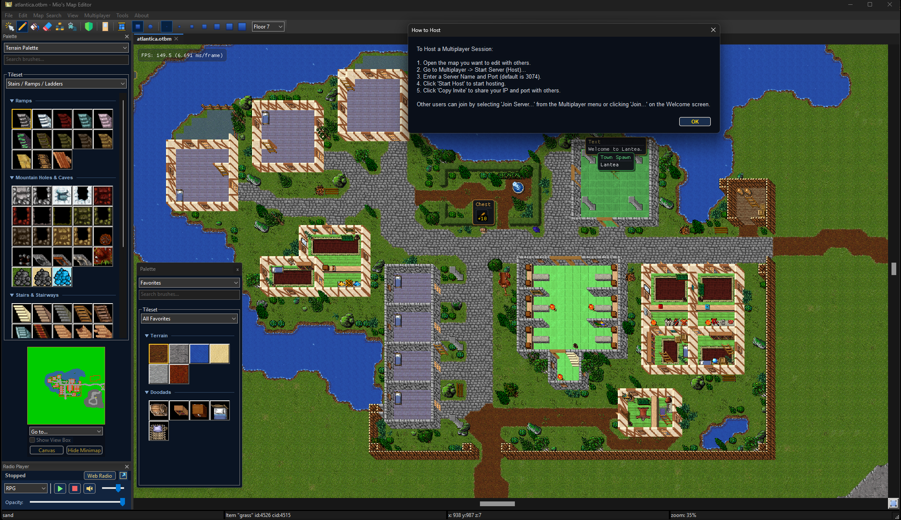
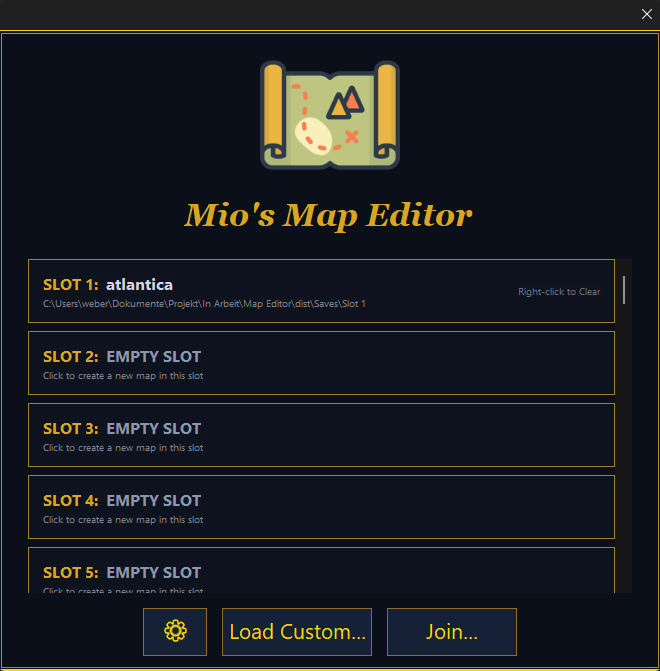

# Mio's Map Editor (MME)

[](https://github.com/Mioshiru/MME/releases)
[](LICENSE.rtf)
[](https://github.com/Mioshiru/MME)
[](https://otland.net/threads/mios-map-editor-a-modern-collaborative-shader-powered-successor-to-rme.304943/)

> **A modern, collaborative, and shader-powered map editor for OpenTibia (OTBM).**  
> MME is an ambitious, next-generation evolution of the legendary Remere's Map Editor (RME), built for modern development workflows, high performance, seamless multiplayer teamwork, and cutting-edge visual mapping tools.

---

## 🌟 Key Highlights & Features

### 👥 Real-Time Collaboration (Multiplayer Live Mapping)
* **Up to 6 Simultaneous Mappers:** Host or join live mapping sessions with up to 6 players (1 Host + 5 Clients) editing the same map simultaneously.
* **Distinct Mapper Identity:** Each team member is assigned a unique player highlight color, live cursor outline, and customizable name tag.
* **Smart Property Conflict Protection:** Editing tile, creature, spawn, or item properties temporarily locks the element, preventing accidental overwriting by teammates.
* **Camera Follow Mode:** Instantly lock and follow another mapper's viewport with a single click.
* **Alt + Click Pings & Sticky Notes:** Send animated ping rings to coordinates or leave persistent notes for your team.
* **Auto-AFK & Keep-Alive:** Real-time idle detection ([AFK] status after 5 minutes) and seamless re-syncing on connection recovery.
* **Frictionless Hosting:** Automated firewall integration triggering standard OS prompts without cumbersome port checks.

### 🎨 Next-Gen Rendering, Shaders & Visuals
* **Modern Shader Pipeline:** Deferred rendering, Global Illumination (GI) raytracing, retro CRT filters, and post-processing blur directly on the canvas.
* **High-DPI & Ultrawide Support:** Pixel-perfect 512x512 vector icons resampled with high-quality filtering for 1440p and 4K displays.
* **Dark Gold Theme:** Elegant, distraction-free modern UI across all palettes, dialogs, minimap widgets, and sub-windows.
* **Interactive ImGui Overlay Minimap:** Dockable, zoomable, and features click-to-teleport camera navigation.
* **Radial Tool Wheel (`Shift + Q`):** Rapid vector-styled tool selection wheel centered directly at your mouse cursor.

### 📁 Interactive Palettes & Favorites 2.0
* **Interactive Collapsible Sections:** Categorized tilesets with clickable accordion headers (▼ / ▶) that save vertical space in both Icon View and List View.
* **Smart Palette Search:** Typing into the search bar dynamically filters and automatically opens matching collapsed categories.
* **Automatic Favorites Categorization:** Favorited brushes are automatically sorted into clean sections (*Terrain*, *Walls & Railings*, *Doodads*, *Items*, *Monsters*, *NPCs*) with live palette synchronization.
* **Unified Nature & Biome Tileset:** All biomes (Grasslands, Mountains, Waters, Desert, Snow, Swamp, Caves, Hive, Ocean) consolidated into a single structured tileset with zero duplicate brushes.

### 🛠️ Advanced Mapping & Autobordering Engine
* **Smart Mountain Plateau Fill:** Bucket-fill empty higher floors (e.g. Floor 6 over Floor 7) by automatically detecting the underlying mountain footprint while strictly excluding sloped border skirts.
* **100% Reliable Undo (`Ctrl + Z`) & Redo (`Ctrl + Y`):** Complete state-based batch action queue preserving multi-step history for large bucket fills, pencil strokes, and erasures.
* **Upgraded Eraser Tool:** Configurable brush sizes (`1`–`7`) and shapes, fully clearing ground, items, spawns, and creatures with optional ground protection.
* **No Hotkeys Mode (`Edit -> Map Tools`):** Toggleable mapping mode that disables single-letter hotkeys (`O`, `A`, `P`, `J`, `R`, `Z`, etc.) to prevent accidental triggers while keeping brush sizing (`1`–`7`), WASD panning, and modifier shortcuts active.
* **Smart Wall Decor & Emblems:** Wall hangings and banners automatically detect wall orientation (North vs. West) upon placement and can be manually rotated (`R` / `Z`).
* **CAD-Style Right-Click Tool Canceling:** Right-clicking with an active brush instantly cancels the action and restores the Selection Tool.

### 🧙‍♂️ TFS 1.6 Multi-Tool & Wizard Suite
* **Visual NPC & Dialogue Editor:** Construct NPC dialogue trees, shop buy/sell offers, and generate production-ready TFS 1.6 RevScript Lua files.
* **Quest Chest & Key Manager:** Interactive setup for quest rewards, quest level doors, and Action IDs (`aid`).
* **In-Place House Editing & Diagnostics:** Add/remove house tiles and exits on the fly without recreating houses, backed by an automated house error scanner.
* **One-Click TFS Exporter:** Export generated XML files and RevScript Lua scripts directly into your server's `data/` directory.

### 🎲 Procedural Generation & Quality Assurance
* **Procedural Map & Dungeon Generator:** Generate organic caves, multi-floor dungeons, and customizable houses with native 2-pass wall and ground autobordering, clean doorways, live 2D mini-map preview, and a 1-click Retry workflow.
* **Prefab & Template Library:** Save custom architectural layouts and dungeons to stamp anywhere on your map with a single click.
* **Map Diagnostic & Error Scanner:** Automatically scan and jump to UID conflicts, floating wall segments, and orphaned spawns.
* **Visual Map Diff Tool:** Compare two map files with intuitive green (added) and red (removed/modified) visual overlays.
* **Built-In Fantasy Radio Player:** Stream 24/7 video game soundtracks, chiptunes, remixes, and cozy ambient music from *Rainwave* (*ALL*, *Game*, *Chiptune*, *OC ReMix*, *Covers*, *Chill*) and *RPGamers Radio* with a dockable, transparent audio player window.
* **1-Click GitHub Releases Updater:** Automated release checking, in-app download progress tracking, and instant auto-restart updating from official GitHub releases.

---

## 📸 Screenshots & Showcase

[](docs/mme_editor_overview.png)

| Welcome & Save Slot Manager | Visual NPC & Shop Wizard |
|:---:|:---:|
|  |  |

| Quest Chest & Action ID Creator | Special Interactive Objects Wizard |
|:---:|:---:|
|  |  |

| 1-Click In-App Auto Updater | Modern Radial Tool Wheel (`Shift + Q`) |
|:---:|:---:|
|  |  |

---

## ⌨️ Essential Keyboard Shortcuts

| Shortcut | Action |
|:---|:---|
| `WASD` | Pan / Scroll canvas viewport |
| `1` – `7` / `+` / `-` | Quick select brush sizes (1x1 up to large area) |
| `Tab` | Seamlessly cycle tools: Selection ➔ Pencil ➔ Bucket ➔ Eraser |
| `Ctrl + Z` / `Ctrl + Y` | Undo / Redo last actions (5-step history) |
| `Ctrl + Left Click` | Single asset removal under cursor without affecting ground |
| `Alt + Left Click` | Send multiplayer ping ring / drop sticky map note |
| `Shift + Q` | Open interactive Radial Tool Wheel |
| `Ctrl + Shift + P` | Open Quick Command Palette |
| `Ctrl + C` / `Ctrl + X` / `Ctrl + V` | Copy, Cut, and Paste map selection |
| `Ctrl + B` | Borderize selected area |
| `F10` / `F11` | Take Screenshot / Toggle Fullscreen |
| `Right Click` | Cancel current tool and return to Selection Pointer |

---

## 🛠️ Building from Source

MME uses modern CMake and `vcpkg` for seamless cross-platform builds.

### Prerequisites
* **Compiler:** MSVC (Visual Studio 2022+), GCC 12+, or Clang 15+ with C++20 support.
* **CMake:** Version 3.24 or higher.
* **VCPKG:** C++ package manager.

### 🪟 Windows Build
You can simply run the automated build script:
```cmd
win-build.bat
```
Or build manually via CMake:
```cmd
git clone https://github.com/Mioshiru/MME.git
cd MME
cmake --preset x64-windows
cmake --build build --config Release
```

### 🐧 Linux Build
```bash
./linux-build.sh
```

### 🍏 macOS Build
```bash
./macos-build.sh
```

---

## 🤝 Community & Support

* **GitHub Issues:** Report bugs and submit feature requests via [GitHub Issues](https://github.com/Mioshiru/MME/issues).
* **OTLand Community:** Join the discussion and share feedback on the official [OTLand Thread](https://otland.net/threads/mios-map-editor-a-modern-collaborative-shader-powered-successor-to-rme.304943/).

---

## 📜 License & Credits

* **Mio's Map Editor (MME)** is developed and maintained by **Mioshiru**.
* Based on Remere's Map Editor (RME) and the OTAcademy codebase.
* Licensed under the GNU General Public License (GPLv2) / Open Source. See [`LICENSE.rtf`](LICENSE.rtf) for details.
