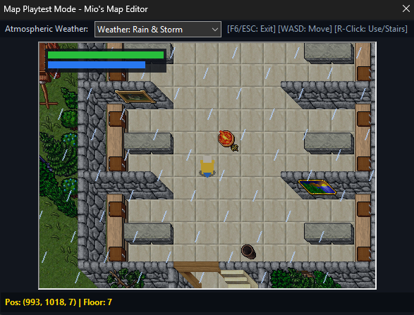

# Mio's Map Editor (MME)

[](https://github.com/Mioshiru/MME/releases)
[](LICENSE.rtf)
[](https://github.com/Mioshiru/MME)
[](https://github.com/Mioshiru/MME)

> **A modern, collaborative, shader-powered map editor and playtesting environment for OpenTibia (OTBM & SEC).**  
> MME is the next-generation evolution of Remere's Map Editor (RME), engineered for professional level designers, high-performance rendering, multi-user live mapping, procedural generation, and instant in-editor playtesting.

---

## 🌟 Key Highlights & Mapper Features (v1.9.4)

### 👥 Real-Time Collaboration & 99% Crash-Proof Netcode
* **Asio Lifecycle Safety & Exception Shields:** Fully protected Asio I/O handlers with atomic `aliveFlag` verification and comprehensive `try-catch` shields preventing crashes on disconnects or malformed packets.
* **Multiplayer Host Approval System (`Multiplayer -> Approvals & Reviews...`):** Host reviews, jumps to location (`📍 Jump to Location`), and approves or rejects town, unique ID, action ID, door, and container creation requests with collision-free ID assignment.
* **Host-Exclusive Map Control:** Only the multiplayer session host can modify map dimensions (`Map -> Properties`), preventing unauthorized client resizing.
* **Ultra-Low Latency Netcode (TCP_NODELAY & 128KB Buffers):** Optimized asynchronous I/O with disabled Nagle algorithm, 128KB socket buffers, and 50Hz adaptive cursor throttling reducing network overhead by >70%.
* **Synchronized Town & World Palette Streaming:** Automatic real-time replication of `map.towns` (`PACKET_TOWN_LIST`) and host corporate "World Palettes" (`PACKET_WORLD_PALETTE`) on client connect.
* **Integrated Team Chat (`Ctrl + Shift + C`):** Dockable & floating in-viewport team chat with minimize-to-statusbar pill notification (`💬 Team Chat`).

### 📦 Ultra-Compact Data Packaging & On-Demand Extraction
* **High-Ratio Version Compression:** Inactive client version definitions compressed from 115 MB down to ~23 MB in `.zip` packages, saving ~90 MB and over 300 loose files.
* **Transparent On-Demand Extractor:** Automatically unpacks any requested client version in <50ms upon selection in Preferences without user intervention.
* **Master 13.10 Extension (`13.10_additions.xml`):** Complete ready-to-use 13.10 tileset, autoborder, doodad, wall, and creature master package.

### 🧩 Modular Palette & UX Polish
* **Live Monster Outfit Previews in Favorites:** Creature brushes in Favorites and brush lists now display animated, full-color creature outfits instead of empty black boxes.
* **Dynamic Responsive Minimap:** Minimap module expands and bilinearly rescales smoothly to arbitrary palette widths. Removed redundant "Show View Box" checkbox.
* **Crash-Free Left/Right Docking:** Stabilized wxAUI docking lifecycle for left/right sidebars and floating palettes.
* **Cleaned Canvas Context Menu:** Streamlined context menu with cleaned tileset list (removed placeholder "Custom World").
* **Instant Live Settings (Zero Restart Required):** All preference changes (UI scale, theme, brush styles, and rendering options) apply instantly on Apply/OK without restarting the editor.

### 🎮 In-Editor Map Playtester (`File -> Test` / `F6`)
* **Zero-Setup In-Process Playtesting:** Test your map instantly without exporting, compiling, or launching a dedicated server and OTClient.
* **Full Character Controls:** Move with WASD or Arrow Keys, complete with directional character sprites, walking animations, and health/mana HUD.
* **Interactive Floor Traversal:** Seamlessly climb stairs, walk up elevation ramps, drop down pits/holes, and right-click ladders or rope spots.
* **World Interaction:** Open/close doors and gates, toggle street lamps, campfires, and torches with live sound and state changes.
* **Dedicated Weather Simulation Suite:** Switch between *Off, Clouds, Rain, Snow, Desert Heat, and Fog* on the fly with customizable ambient particles.

### 🎨 Next-Gen Rendering, Biome Moods & Shaders
* **Cinematic Biome Color Grading (`Preferences -> Graphics -> Visuals`):** 6 curated atmospheric color grading profiles (*Vibrant Fantasy RPG, Dark & Dangerous, Gloomy Crypt & Cave, Golden Sunset, Frozen Frost, Neutral Classic*).
* **Graphic Upgrader (Rich Chroma & Zero Washout):** High-clarity saturation and contrast enhancement (+25% vibrance) with preserved luminance, eliminating overexposure.
* **Cinematic Vignette:** Smooth radial focus darkening with discrete 10-level slider control.
* **Super-Smooth HD Asset Upscaling:** Catmull-Rom bicubic spline & directional edge AA delivering clean curves on sprites, outfits, and terrain.
* **Atmospheric Raycasted Lighting:** Real-time 2D supercover Bresenham raycasting with true wall shadow occlusion and directional wall-mounted torch projection.
* **Dynamic Animated Terrain & Borders:** Fully synchronized water ripples, bubbling lava, coastal wave breakers, and lava cascades.

### 🏰 Procedural World, Dungeon & Cave Generator (`Tools -> Generators`)
* **Native 2-Pass Autobordering Engine:** Generates fully enclosed room perimeters, organic cave networks, and multi-floor dungeons with clean door cutouts and perfect border transitions.
* **Themed Biome Presets:** 1-Click presets for *Ancient Catacombs*, *Lava / Inferno Vault*, *Ice / Glacier Cavern*, *Desert Tomb*, and *Subterranean Sewers*.
* **Live 2D Mini-Map Preview & 1-Click Retry:** Preview generated layouts in real time before applying, with 1-click **"Retry"** to roll new seeds instantly.
* **Strict Non-Destructive Protection:** Protects player houses, spawns, monsters, and quest containers from accidental overwrites.

### 📜 RealOTS & CipSoft Sector Engine (`File -> Import/Export -> .sec`)
* **Full 32x32 Sector Engine (`iomap_sec`):** Directly load, edit, and save original 7.4 / 7.72 / 8.0 CipSoft sector files across all floors (0–15).
* **`objects.srv` & `monster.db` Integration:** Native parsing and saving for server flags, item mappings, and monster spawn coordinates.
* **Bidirectional Map Converter:** 1-Click conversion suite between OpenTibia `.otbm` maps and CipSoft `.sec` sector directories.

### 👹 Monster Designer & Item Asset Inspector
* **Native In-Editor Monster Creator (`Tools -> Monster Editor`):** Design custom monsters with health, combat stats, spell attacks, elemental resistances, and loot tables with 1-click registration into creature palettes.
* **Visual Outfit Designer (TLG Engine):** Interactive 132-color Tibia palette matrix with presets, addons, and mounts.
* **OTB & Item Inspector Suite (`Tools -> Item & Assets Editor`):** Inspect item flags, properties, and capacities with direct integration into Arch-Mina Assets Editor.

### 📁 Streamlined Palettes, Brushes & UX Polish
* **In-Viewport "⭐ Add to Favorites":** Right-click any ground, doodad, wall, or creature directly on the canvas to add it to your Favorites palette instantly.
* **Self-Healing Auto-Layout Palette Grid:** Palette icons dynamically recalculate layout columns on every window resize and paint event.
* **Smart Mountain Plateau Fill:** Bucket-fill higher elevations (e.g. Floor 6 directly over Floor 7) with automatic cliff footprint detection and strict skirt exclusion.
* **100% Reliable Undo (`Ctrl + Z`) & Redo (`Ctrl + Y`):** Complete state-based batch action queue preserving multi-step history for large fills, brush strokes, and erasures.
* **Interactive Collapsible Tilesets:** Clean accordion categories (▼ / ▶) with dynamic search auto-expansion.
* **Radial Tool Wheel (`Shift + Q`):** Rapid 8-tool vector wheel centered directly at your mouse cursor.
* **Built-In Fantasy Web Radio:** Dockable 24/7 video game soundtrack player streaming Rainwave and RPGamers Radio.
* **1-Click In-App GitHub Auto-Updater:** Automated release detection, progress download, and zero-effort self-updating.

---

## 📸 Screenshots & Showcase

[](docs/mme_editor_overview.png)

| In-Editor Playtester (`F6`) | Procedural Map & Dungeon Generator |
|:---:|:---:|
|  |  |

| Monster Creator & LookType Designer | Item & Assets Inspector Suite |
|:---:|:---:|
|  |  |

| NPC Dialogue & Shop Editor | Modern Radial Tool Wheel (`Shift + Q`) |
|:---:|:---:|
|  |  |

| Welcome & Save Slot Manager | 1-Click In-App Auto Updater |
|:---:|:---:|
|  |  |

---

## ⌨️ Essential Keyboard Shortcuts

| Shortcut | Action |
|:---|:---|
| `F6` | **Launch In-Editor Playtester** (WASD move, floor traversal, door/light toggle) |
| `WASD` / `Arrow Keys` | Pan / Scroll canvas viewport (or walk in Playtest mode) |
| `1` – `7` / `+` / `-` | Quick select brush sizes (1x1 up to large area) |
| `Tab` | Cycle tools: Selection ➔ Pencil ➔ Bucket ➔ Eraser |
| `Ctrl + Z` / `Ctrl + Y` | Undo / Redo last actions (5-step history) |
| `Z` / `R` | Rotate selected / hovered item (ramps, stairs, furniture, hangings) |
| `Shift + Q` | Open interactive Radial Tool Wheel |
| `Ctrl + Left Click` | Single asset removal under cursor without affecting ground |
| `Alt + Left Click` | Send multiplayer ping ring / drop sticky map note |
| `Ctrl + Shift + P` | Open Quick Command Palette |
| `Ctrl + C` / `Ctrl + X` / `Ctrl + V` | Copy, Cut, and Paste map selection |
| `Ctrl + B` | Borderize selected area |
| `F10` / `F11` | Take Screenshot / Toggle Fullscreen |
| `Right Click` | Cancel current tool and return to Selection Pointer |

---

## 🛠️ Building from Source

MME uses modern CMake and `vcpkg` for seamless cross-platform builds.

### Prerequisites
* **Compiler:** MSVC (Visual Studio 2022+), GCC 12+, or Clang 15+ with C++20 support.
* **CMake:** Version 3.24 or higher.
* **VCPKG:** C++ package manager.

### 🪟 Windows Build
You can simply run the automated build script:
```cmd
win-build.bat
```
Or build manually via CMake:
```cmd
git clone https://github.com/Mioshiru/MME.git
cd MME
cmake --preset x64-windows
cmake --build build --config Release
```

### 🐧 Linux Build
```bash
./linux-build.sh
```

### 🍏 macOS Build
```bash
./macos-build.sh
```

---

## 🤝 Community & Support

* **GitHub Issues:** Report bugs and submit feature requests via [GitHub Issues](https://github.com/Mioshiru/MME/issues).
* **OTLand Community:** Join the discussion and share feedback on the official [OTLand Thread](https://otland.net/threads/mios-map-editor-a-modern-collaborative-shader-powered-successor-to-rme.304943/).

---

## 📜 License & Credits

* **Mio's Map Editor (MME)** is developed and maintained by **Mioshiru**.
* Based on Remere's Map Editor (RME) and the OTAcademy codebase.
* Licensed under the GNU General Public License (GPLv2) / Open Source. See [`LICENSE.rtf`](LICENSE.rtf) for details.
